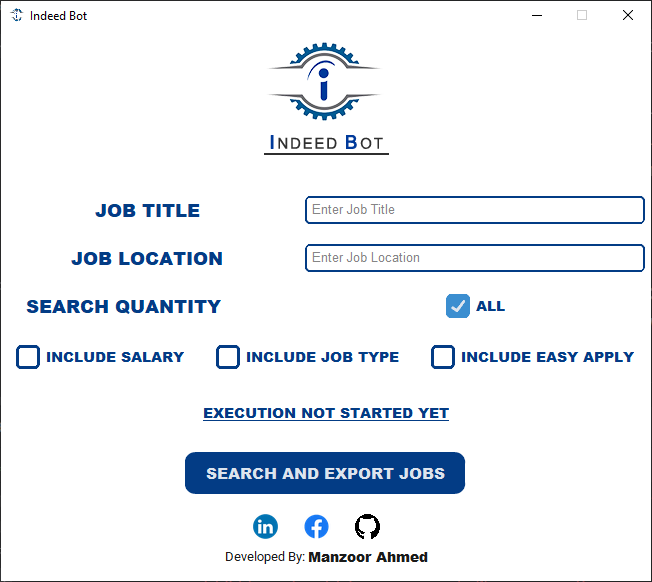

# MVC_IndeedBot_Application

## Overview

MVC_IndeedBot_Application is a comprehensive desktop application designed for scraping job listings from pk.indeed.com. The application allows users to search for jobs based on job title and location, with options to limit the number of results. Users can also select additional data to scrape, such as salary range, job type, and easy apply options through checkboxes. This project is intended for study purposes, and anyone can use it without any copyright issues.

## Features

- **Search Jobs:** Enter job title and location to search for relevant job listings.
- **Limit Results:** Specify the number of job listings to scrape.
- **Additional Filters:** Use checkboxes to scrape additional information such as salary range, job type, and easy apply options.
- **User-Friendly Interface:** Built with CustomTkinter and Tkinter for a responsive and easy-to-use interface.
- **Data Processing:** Utilizes Selenium and BeautifulSoup for web scraping, and Pandas for data manipulation.

## Getting Started

### Prerequisites

Before you begin, ensure you have met the following requirements:

- Python 3.x installed on your machine
- pip (Python package installer)
- Google Chrome browser
- ChromeDriver (Ensure the ChromeDriver version matches your Google Chrome version)

### Installation

1. Clone the repository

   ```sh
   git clone https://github.com/yourusername/MVC_IndeedBot_Application.git

2. Install the required Python libraries:

   ```sh
   pip install selenium
   pip install beautifulsoup4
   pip install pandas
   pip install pillow
   pip install customtkinter
   sudo apt-get install python3-tk

3. Use the graphical interface to:

  • Enter the job title and location.
  • Specify the number of results to scrape.
  • Select additional data options via checkboxes (Salary range, Job Type, Easy Apply).
  • Click on the "Start Scraping" button to begin the process.

4. Scraped data will be displayed and saved in a CSV file for further analysis.

## Usage

1. Open a terminal and navigate to the project directory.

2. Run the application

   ```sh
   python main.py

## Project Structure

- `main.py`: The main entry point of the application.
- `scraper/`: Contains modules for web scraping using Selenium and BeautifulSoup.
- `gui/`: Contains modules for the graphical user interface built with CustomTkinter and Tkinter.
- `data/`: Stores the scraped data in CSV format.

## Libraries and Frameworks

### Backend Libraries

1. **Selenium**
   - Used for automating web browser interaction.
2. **BeautifulSoup**
   - Used for parsing HTML and XML documents.
3. **Pandas**
   - Used for data manipulation and analysis.
4. **PIL (Python Imaging Library)**
   - Used for image processing.

### FrontEnd Library

1. **CustomTkinter**
   - Provides custom styling for Tkinter widgets.
2. **Tkinter**
   - Standard GUI toolkit for Python.

## Contributing

Contributions are welcome! Please follow these steps:

1. Fork the project.
2. Create your feature branch (`git checkout -b feature/AmazingFeature`).
3. Commit your changes (`git commit -m 'Add some AmazingFeature'`).
4. Push to the branch (`git push origin feature/AmazingFeature`).
5. Open a pull request.

## Acknowledgements

- Special thanks to the developers of Selenium, BeautifulSoup, Pandas, PIL, CustomTkinter, and Tkinter for their excellent libraries.
- This project is inspired by the need for efficient job searching and data analysis.

---

Feel free to customize this `Readme.md` file further to better fit your project specifics!
